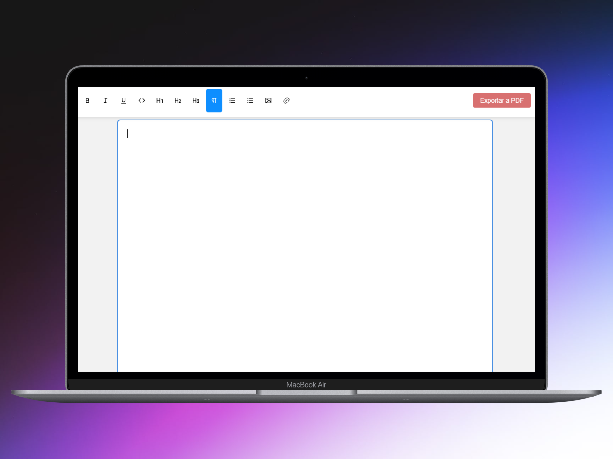

# Editor de texto estilo Google Docs

Un editor de texto minimalista basado en **Tiptap**, con soporte para exportación a **PDF** y posibilidad de insertar imágenes mediante URL.

Para probarlo puedes hacerlo desde el siguiente <a href="https://editordetextosimple.netlify.app/">enlace</a>.

## Vista previa


## ✨ Características

- Edición de texto enriquecido (negrita, cursiva, encabezados, listas, etc.).
- Inserción de **imágenes mediante URL**.
- Exportación de documentos a **PDF**.
- Interfaz sencilla y fácil de usar.

## ⚠️ Limitación al exportar a PDF

Las imágenes añadidas mediante URL podrían **no aparecer en el PDF exportado** debido a restricciones de seguridad del navegador (**CORS**).  
Esto ocurre si la imagen proviene de un servidor que no permite su uso externo.

## 🛠 Tecnologías utilizadas

- **Editor:** [Tiptap](https://tiptap.dev/)  
- **Frontend:** React, CSS  
- **Exportación a PDF:** jsPDF, html2canvas

## 🚀 Instalación y uso

1. Clona este repositorio:
   ```bash
   git clone https://github.com/TU_USUARIO/nombre-proyecto.git
   npm install
   npm run dev

